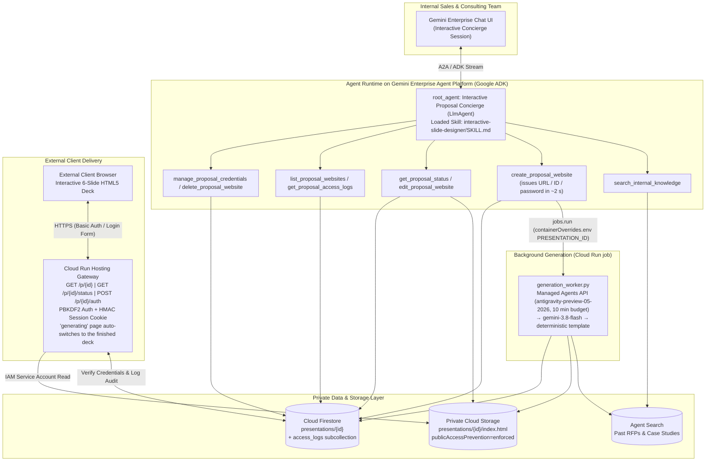

# Gemini Enterprise Proposal Site Publisher (`ge-proposal-site-publisher`)

[](LICENSE)
[](https://www.python.org/)
[](https://google.github.io/adk-docs/)

**English** | **[日本語 (Japanese)](#日本語ガイド-japanese)**

An end-to-end reference implementation and reusable Agent Skill suite for building an **Interactive Proposal Website Concierge Agent** on **Google Cloud (Gemini Enterprise + Agent Runtime on Gemini Enterprise Agent Platform + Cloud Run + Cloud Storage + Firestore)**.

Unlike static one-shot slide generators, `root_agent` operates as an **Interactive Proposal Concierge (`LlmAgent`)** that:
1. **Consults Conversationally First**: Greets users naturally (never generating slides prematurely on `"Hello"` or `"こんにちは"`), searches internal knowledge via Agent Search on Gemini Enterprise Agent Platform (`search_internal_knowledge`), and collaborates on a 6-slide narrative outline.
2. **Issues the Private URL Immediately, Generates the Deck in the Background**: `create_proposal_website` returns the share URL, viewer ID and password within ~2 seconds and hands the heavy lifting to a **Cloud Run job** (`app/generation_worker.py`). The same URL shows a branded *"generating"* page that polls `GET /p/{id}/status` and **switches to the finished deck automatically** (no re-login). Generation follows a tiered budget: **Managed Agents API** (`antigravity-preview-05-2026`, Interactions API on `locations/global`, default budget 10 min) → **`gemini-3.8-flash` structured output** → deterministic skill template, so a finished page is always published and the engine used is recorded in Firestore (`generation_engine`).
3. **Generates Bespoke 6-Slide Interactive HTML5 Websites**: Loads the embedded **`interactive-slide-designer`** `SKILL.md` to produce a self-contained, 16:9 responsive HTML5 presentation deck with 6 distinct layout archetypes (`hero-cover`, `bento-executive-summary`, `as-is-to-be-comparison`, `architecture-flow`, `roadmap-timeline`, `roi-and-next-steps`) and 5 executive color themes (`sky`, `emerald`, `violet`, `amber`, `rose`).
4. **Publishes Behind Zero-Trust Per-Client Authentication**: Uploads the HTML5 deck to a **private Cloud Storage bucket** (`publicAccessPrevention: enforced`), stores PBKDF2-HMAC-SHA256 (`120,000` iterations) credentials in **Firestore**, and serves external clients through a **Cloud Run Authentication & Audit Gateway**.
5. **Manages the Full Post-Publication Lifecycle in Chat**: Supports generation progress checks (`get_proposal_status`), conversational slide editing (`edit_proposal_website`), portfolio listing (`list_proposal_websites`), client access log auditing (`get_proposal_access_logs`), password rotation & expiration extension (`manage_proposal_credentials`), and instant revocation (`delete_proposal_website`). Every tool returns a structured `status` payload (`GENERATING` / `NOT_FOUND` / `ERROR` …) instead of raising, so a single bad argument can never abort the chat turn.

---

## Architecture



---

## Repository Structure

```text
ge-proposal-site-publisher/
├── skills/
│   ├── ge-proposal-site-publisher/        # Full-stack architecture, IAM & deployment skill
│   │   ├── SKILL.md
│   │   ├── references/architecture_and_iam.md
│   │   └── scripts/verify_sanitization.py
│   └── interactive-slide-designer/        # 6-slide HTML5 layout & design system skill
│       ├── SKILL.md
│       ├── references/design_patterns.md
│       └── scripts/validate_slide_deck.py
├── proposal_agent/                        # Google ADK Interactive Concierge Agent
│   ├── app/
│   │   ├── agent.py                       # root_agent (LlmAgent) + 8 lifecycle tools (never raise)
│   │   ├── generation_worker.py           # Cloud Run job entrypoint: tiered deck synthesis + publish
│   │   ├── fast_api_app.py                # FastAPI entrypoint (ADK + A2A + Reasoning Engine)
│   │   ├── skills/interactive-slide-designer/
│   │   └── templates/deck_base.html.j2    # 6-layout HTML5 / Tailwind / SVG template
│   ├── Dockerfile                         # shared by the Agent Runtime build and the Cloud Run job
│   ├── .gcloudignore
│   └── pyproject.toml
├── hosting_gateway/                       # Cloud Run Auth & Private GCS Streaming Proxy
│   ├── main.py                            # /health, /healthz, /p/{id}, /p/{id}/status, /p/{id}/auth
│   ├── Dockerfile
│   └── requirements.txt
├── infra/
│   ├── deploy.sh                          # One-command GCP provisioning & deployment (7 phases, SKIP_* flags)
│   ├── cleanup.sh                         # Teardown helper
│   └── seed_datastore.py                  # Seeds synthetic RFP & case study documents
└── tests/
    ├── test_proposal_agent_and_gateway.py # Offline unit & security test suite (pytest, 14 tests)
    ├── run_live_e2e_verification.py       # 6-step live cloud E2E verification script
    └── run_remote_multiturn_e2e.py        # Multi-turn chat E2E against the deployed Agent Runtime
```

---

## Quickstart (English)

### 1. Run Offline Unit & Security Tests

```bash
uv run --project proposal_agent pytest tests/test_proposal_agent_and_gateway.py -v
python3 skills/ge-proposal-site-publisher/scripts/verify_sanitization.py .
```

### 2. Deploy to Google Cloud

```bash
export PROJECT_ID="your-gcp-project-id"
export REGION="us-central1"
# Optional (first deployment only): register with an existing Gemini Enterprise app.
# Full engine resource name required by agents-cli >= 1.4.0 (a bare engine id is expanded automatically):
# export GE_APP_ID="projects/<project-number>/locations/global/collections/default_collection/engines/<engine-id>"

bash infra/deploy.sh
# Phases: APIs/IAM → bucket → Firestore → Agent Search seed → Cloud Run gateway
#         → Cloud Run job (proposal-deck-generator) → Agent Runtime (+ Gemini Enterprise)
# Re-deploy only the agent:  SKIP_INFRA=1 SKIP_SEED=1 SKIP_GATEWAY=1 SKIP_JOB=1 bash infra/deploy.sh
```

### 3. Run Live End-to-End Verification

```bash
export PROJECT_ID="your-gcp-project-id"
export HOSTING_BASE_URL="$(gcloud run services describe proposal-hosting-gateway --region=us-central1 --project=${PROJECT_ID} --format='value(status.url)')"

uv run --project proposal_agent python tests/run_live_e2e_verification.py

# Multi-turn chat against the deployed Agent Runtime (outline → "はい。skyで。" → URL/ID/password → auto-switch)
export REASONING_ENGINE_ID="projects/<project-number>/locations/us-central1/reasoningEngines/<id>"
uv run --project proposal_agent python tests/run_remote_multiturn_e2e.py
```

---

## How the Asynchronous Publishing Flow Works

| Step | Component | What happens |
|---|---|---|
| 1 | `create_proposal_website` (Agent Runtime) | Validates input, hashes a fresh password, writes the Firestore document with `generation_status="generating"`, triggers the Cloud Run job (`GENERATION_JOB_NAME`) with `PRESENTATION_ID`, and returns `status="GENERATING"` + URL / viewer ID / password in ~2 s. If the job cannot be triggered it falls back to an in-process thread (`GENERATION_TRIGGER_MODE=auto`). |
| 2 | Hosting gateway `GET /p/{id}` | After Basic-auth / login-form authentication, serves a branded *generating* page that polls `GET /p/{id}/status` every 5 s. |
| 3 | `generation_worker.py` (Cloud Run job) | `knowledge_search` → `managed_agents` (Interactions API, `background=True`, polled until `completed`, cancelled at the deadline) → on timeout/failure `gemini_fast` (`gemini-3.8-flash` structured output) → deterministic template. Renders + validates the HTML, uploads it to private GCS and sets `generation_status="ready"` with `generation_engine`. |
| 4 | Browser | The polling page sees `ready` and reloads; the finished deck streams from GCS through the same authenticated URL. |
| 5 | `get_proposal_status` | Reports phase / engine / elapsed time in chat. If a document has been generating longer than `GENERATION_STALE_MINUTES` (default 13) it finalises it inline with the fallback engine, so no site stays stuck. |

> **Why asynchronous?** In Google ADK an exception raised inside a tool aborts the whole agent turn (`DynamicNodeFailError`), and Gemini Enterprise then shows the tool chip without any final answer. Long synchronous generation inside a tool (multi-minute Managed Agents runs) hits the same wall. The design above keeps every tool call short, never raises, and moves the long-running work to a job with its own 25-minute timeout.

---

## 日本語ガイド (Japanese)

### 概要

本リポジトリは、**Gemini Enterprise** のチャット画面から対話形式でクライアント向け提案書を企画・壁打ちし、**6枚構成のインタラクティブHTML5プレゼンテーションWebサイト**を生成・限定公開・ライフサイクル管理するためのリファレンス実装および再利用可能なエージェントスキル（`SKILL.md`）一式です。

### 主な特徴

1. **対話型コンシェルジュ (`LlmAgent`) による段階的ヒアリング**:
   - 「こんにちは」などの挨拶に対して勝手にスライド生成を開始せず、まず実行可能な3つの機能を案内し、クライアント名・課題・希望テーマカラーをヒアリングします。
   - 過去のRFPや導入事例を `search_internal_knowledge` で検索し、6枚構成のアウトライン案を提示して合意形成してからWebサイトを発行します（即時生成を求められた場合はワンショット発行にも対応）。
2. **`interactive-slide-designer` スキルによる高品質6枚構成HTML5デッキ**:
   - 全6スライドがそれぞれ異なる専用レイアウト（`hero-cover` / `bento-executive-summary` / `as-is-to-be-comparison` / `architecture-flow` / `roadmap-timeline` / `roi-and-next-steps`）と5種類のカラーテーマ（`sky` / `emerald` / `violet` / `amber` / `rose`）を備え、キーボード（`←` / `→` / `F`）・スワイプ・印刷出力に対応します。
   - スライド本体の生成は Gemini Enterprise Agent Platform の Managed Agents API（`antigravity-preview-05-2026`、`locations/global` の Interactions API）を第一候補とし、時間予算（既定10分）を超えた場合や失敗した場合は `gemini-3.8-flash` の構造化出力、さらに決定論的テンプレートへ自動的に切り替わります。どのエンジンで完成したかは Firestore の `generation_engine` に記録され、「生成状況を教えて」と聞けば `get_proposal_status` が回答します。
3. **URL・ID・パスワードの即時発行とバックグラウンド生成（自動切替）**:
   - `create_proposal_website` は約2秒で限定公開URL・閲覧ID・パスワードを返し、スライド生成は Cloud Run ジョブ（`app/generation_worker.py`）へ引き渡します。発行直後に同じURLを開くと「生成中」ページが表示され、`GET /p/{id}/status` を5秒ごとに確認して、完成すると再ログインなしで提案ページへ自動的に切り替わります（通常1〜5分、最長でも約10分で完成）。
4. **Cloud Run認証ゲートウェイ ＋ 非公開Cloud Storage ＋ Firestoreによるセキュア限定公開**:
   - 生成されたHTMLはパブリックアクセスを完全遮断（`publicAccessPrevention: enforced`）した非公開GCSバケットに保存され、案件ごとに自動発行される閲覧ID・パスワード（PBKDF2-HMAC-SHA256 12万回ストレッチング）を知るクライアントのみがCloud Run経由で閲覧できます。
5. **発行後のフルライフサイクル管理（8つの専用ツール）**:
   - `search_internal_knowledge`: 社内ナレッジ・過去提案事例の検索
   - `create_proposal_website`: 限定公開URL・閲覧ID・パスワードの即時発行とバックグラウンド生成の起動
   - `get_proposal_status`: 生成フェーズ・使用エンジン・経過時間の確認（長時間停滞したサイトはフォールバックで自動完成）
   - `edit_proposal_website`: 発行済みサイトのタイトル・テーマカラー・スライド内容の対話修正と再デプロイ
   - `list_proposal_websites`: 発行済みプレゼンサイト一覧・ステータス確認
   - `get_proposal_access_logs`: クライアントのアクセス日時・認証方式・IP等の閲覧ログ監査
   - `manage_proposal_credentials`: パスワードのローテーション（再発行）および有効期限延長
   - `delete_proposal_website`: 公開停止（ステータスを `revoked` に変更し即座にHTTP 403遮断）およびGCSオブジェクト削除
   - いずれのツールも例外を投げず、`status`（`GENERATING` / `NOT_FOUND` / `ERROR` など）を含む構造化レスポンスを返します。Google ADK ではツール内の例外がターン全体を中断させ（`DynamicNodeFailError`）、Gemini Enterprise 側ではツールチップだけが表示されて回答が返らない状態になるためです。

### デプロイ手順

```bash
export PROJECT_ID="your-gcp-project-id"
export REGION="us-central1"
bash infra/deploy.sh
```

## License

Apache License 2.0. See [LICENSE](LICENSE) for details.
