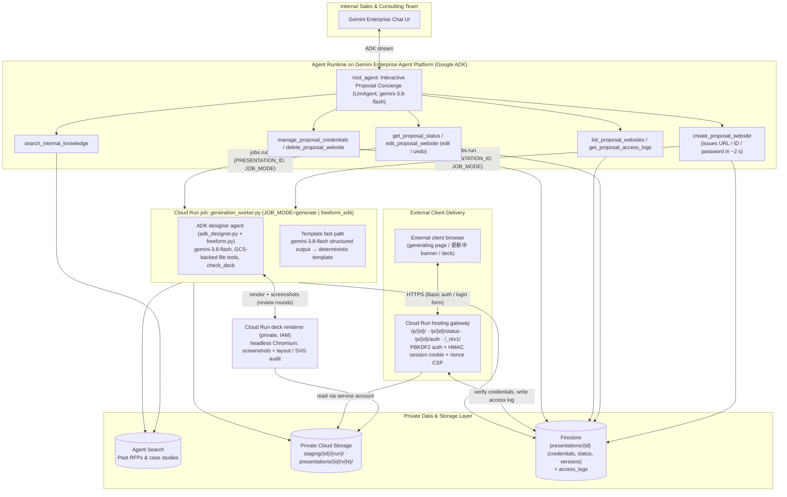

# Gemini Enterprise Proposal Site Publisher (`ge-proposal-site-publisher`)

[](LICENSE)
[](https://www.python.org/)
[](https://google.github.io/adk-docs/)

**English** | **[日本語 (Japanese)](#日本語ガイド-japanese)**

An end-to-end reference implementation and reusable Agent Skill suite for building an **Interactive Proposal Website Concierge Agent** on **Google Cloud (Gemini Enterprise + Agent Runtime on Gemini Enterprise Agent Platform + Cloud Run + Cloud Storage + Firestore)**. Every model call runs on `gemini-3.8-flash` through Google ADK.

Unlike static one-shot slide generators, `root_agent` operates as an **Interactive Proposal Concierge (`LlmAgent`)** that:

1. **Consults conversationally first**: greets users naturally (never generating slides prematurely on `"Hello"` or `"こんにちは"`), searches internal knowledge via Agent Search (`search_internal_knowledge`), and agrees on a storyline before publishing.
2. **Issues the private URL immediately and generates in the background**: `create_proposal_website` returns the share URL, viewer ID and password within ~2 seconds, writes a per-deal Firestore document and starts a **Cloud Run job** (`app/generation_worker.py`). The same URL shows a branded *generating* page that switches to the finished deck automatically (no re-login).
3. **Designs freely with an ADK designer agent (default)**: inside the job, an ADK `LlmAgent` (`app/adk_designer.py`, `FREEFORM_ADK_MODEL=gemini-3.8-flash`) writes HTML/CSS, SVG diagrams, ECharts chart JSON and optional AI image requests through Cloud Storage-backed file tools. The private **deck renderer** (Cloud Run, headless Chromium) screenshots every slide; the screenshots and layout findings go back to the same ADK session for up to two **review rounds** before publishing. Free design takes 通常 7〜11 分（最長約 20 分）.
4. **Offers a fast template path**: on request (高速モード) or when no free-form build is publishable, the 6-slide `interactive-slide-designer` template is filled by `gemini-3.8-flash` structured output (deterministic template as the last resort), typically in 1–5 minutes.
5. **Checks grounding**: percentages that appear in no input (unless labelled as an estimate), unknown e-mail addresses and work-file names are flagged by the `check_deck` tool and in the review turn, so the agent removes them before publishing.
6. **Edits, versions and undoes in chat**: free-form edits are queued to the same job (`JOB_MODE=freeform_edit`, 通常 5〜7 分（最長約 15 分）); the open deck shows a live **「更新中」** banner and reloads itself when the new version is published. The last 10 versions are kept and **undo only moves the version pointer**. Edit tools report only `verified_changes` (a deterministic diff of the published files), never the model's own claims.
7. **Publishes behind per-deal authentication**: decks live in a **private Cloud Storage bucket** (`publicAccessPrevention: enforced`); viewer credentials are PBKDF2-HMAC-SHA256 hashes (120,000 iterations) in **Firestore**, verified by the **Cloud Run hosting gateway**, which also writes viewer access logs and serves free-form decks with a per-request nonce CSP.
8. **Never aborts the chat turn**: every tool returns a structured `status` payload (`GENERATING` / `EDIT_QUEUED` / `NOT_FOUND` / `ERROR` …) instead of raising.

---

## Architecture



---

## Repository Structure

```text
ge-proposal-site-publisher/
├── skills/
│   ├── ge-proposal-site-publisher/        # Architecture, IAM & deployment skill
│   │   ├── SKILL.md
│   │   ├── references/architecture_and_iam.md
│   │   └── scripts/verify_sanitization.py
│   ├── freeform-deck-designer/            # Output contract & rubric for the ADK designer agent
│   │   └── SKILL.md
│   └── interactive-slide-designer/        # 6-slide template design system (fast path / fallback)
│       ├── SKILL.md
│       ├── references/design_patterns.md
│       └── scripts/validate_slide_deck.py
├── proposal_agent/                        # Google ADK concierge agent + generation worker
│   ├── app/
│   │   ├── agent.py                       # root_agent (LlmAgent) + lifecycle tools (never raise)
│   │   ├── generation_worker.py           # Cloud Run job entrypoint (generate / freeform_edit)
│   │   ├── adk_designer.py                # ADK designer agent: GCS file tools, check_deck, sessions
│   │   ├── freeform.py                    # Free-form pipeline: draft → images → render → review → publish
│   │   ├── deck_contract.py               # Output contract, sanitiser, CSP, describe_changes() (single source of truth)
│   │   ├── deck_runtime/                  # Shared runtime (scaling, navigation, charts) + ECharts (Apache-2.0, see NOTICE)
│   │   ├── skills/                        # freeform-deck-designer + interactive-slide-designer (loaded at runtime)
│   │   ├── templates/deck_base.html.j2    # Template deck (immersive-dark / clean-light / editorial-light)
│   │   └── fast_api_app.py                # FastAPI entrypoint (ADK + A2A + Reasoning Engine routes)
│   ├── Dockerfile                         # Shared by the Agent Runtime build and the Cloud Run job
│   └── pyproject.toml
├── hosting_gateway/                       # Cloud Run auth gateway & private GCS streaming proxy
│   ├── main.py                            # /p/{id}[/], /p/{id}/status, /p/{id}/auth, assets, charts, /_rt/v1/
│   └── Dockerfile
├── deck_renderer/                         # Private Cloud Run renderer (headless Chromium)
│   ├── main.py                            # POST /v1/render → per-slide screenshots + layout / SVG audit
│   └── Dockerfile
├── infra/
│   ├── deploy.sh                          # One-command provisioning & deployment (8 phases, SKIP_* flags)
│   ├── cleanup.sh                         # Teardown helper (gateway, renderer, job)
│   └── seed_datastore.py                  # Seeds synthetic RFP & case-study documents
└── tests/                                 # Offline pytest suites + live E2E scripts
```

`infra/deploy.sh` copies `proposal_agent/app/deck_contract.py` and `proposal_agent/app/deck_runtime/` into `hosting_gateway/` and `deck_renderer/` before each build; those copies are git-ignored.

---

## Quickstart (English)

### 1. Run offline tests and the sanitization audit

```bash
cd proposal_agent && uv sync && cd ..
proposal_agent/.venv/bin/python -m pytest tests -q
python3 skills/ge-proposal-site-publisher/scripts/verify_sanitization.py .
```

### 2. Deploy to Google Cloud

```bash
export PROJECT_ID="your-gcp-project-id"
export REGION="us-central1"
# Optional: register with an existing Gemini Enterprise app and bind DataStores to its Engine.
# Full engine resource name required by agents-cli >= 1.4.0 (a bare engine id is expanded automatically):
# export GE_APP_ID="projects/<project-number>/locations/global/collections/default_collection/engines/<engine-id>"

# Option A: Sandbox / evaluation deployment (auto-seeds synthetic Google Drive RFP + Salesforce CRM DataStore)
bash infra/deploy.sh

# Option B: Production deployment with real 1st Party DataConnector DataStores (Google Drive + Salesforce)
# Preserves existing DataStores without synthetic data pollution and binds both stores to GE_APP_ID:
# SEED_MODE=real \
# AGENT_SEARCH_DATASTORE_ID="drive-past-rfps-ds,salesforce-crm-ds" \
# GE_APP_ID="projects/<project-number>/locations/global/collections/default_collection/engines/<engine-id>" \
# PROPOSAL_BRAND_NAME="Your Company Proposal Portal" \
# PROPOSAL_BRAND_BADGE="EXECUTIVE PROPOSAL" \
# bash infra/deploy.sh

# Phases: APIs → bucket + IAM → Firestore → Agent Search seed / Engine binding → Cloud Run gateway
#         → Cloud Run deck renderer → Cloud Run job (proposal-deck-generator) → Agent Runtime (+ Gemini Enterprise)
# Re-deploy only the agent:  SKIP_INFRA=1 SKIP_SEED=1 SKIP_GATEWAY=1 SKIP_RENDERER=1 SKIP_JOB=1 bash infra/deploy.sh
# Template-only deployment (no renderer, no free design):  FREEFORM_DESIGN_ENABLED=false bash infra/deploy.sh
```

### 3. Run live end-to-end verification

```bash
export PROJECT_ID="your-gcp-project-id"
export HOSTING_BASE_URL="$(gcloud run services describe proposal-hosting-gateway --region=us-central1 --project=${PROJECT_ID} --format='value(status.url)')"

proposal_agent/.venv/bin/python tests/run_live_e2e_verification.py

# Multi-turn chat against the deployed Agent Runtime (outline → "はい。skyで。" → URL/ID/password → auto-switch)
export REASONING_ENGINE_ID="projects/<project-number>/locations/us-central1/reasoningEngines/<id>"
proposal_agent/.venv/bin/python tests/run_remote_multiturn_e2e.py
```

---

## How Generation, Editing and Delivery Work

| Step | Component | What happens |
|---|---|---|
| 1 | `create_proposal_website` (Agent Runtime) | Validates input, hashes a fresh password, writes `presentations/{id}` with `generation_status="generating"`, triggers the Cloud Run job with `PRESENTATION_ID` / `JOB_MODE=generate`, and returns `status="GENERATING"` + URL / viewer ID / password + `estimated_completion` in ~2 s. Falls back to an in-process thread if the job cannot be triggered (`GENERATION_TRIGGER_MODE=auto`). |
| 2 | Hosting gateway `GET /p/{id}/` | After Basic auth or the login form, serves a branded *generating* page that polls `GET /p/{id}/status` and shows the current phase. |
| 3 | `generation_worker.py` → `freeform.py` (free design) | `freeform_staging` (brief + knowledge into `staging/{id}/{run}/input/`) → `freeform_drafting` (ADK designer writes `deck/`) → `freeform_images` (`gemini-3.1-flash-image`, labelled 「AI生成イメージ」) → `freeform_checking` (static contract + grounding check + renderer screenshots) → `freeform_reviewing` (screenshots back to the same ADK session, max `FREEFORM_REVIEW_ROUNDS`=2) → `freeform_publishing` (best valid build to `presentations/{id}/v{N}/`). |
| 3′ | `generation_worker.py` (template path) | `knowledge_search` → `gemini-3.8-flash` structured output → deterministic template → `rendering`. Used for 高速モード and as the fallback when no free-form build is publishable (`generation_engine` gets `+freeform_fallback:<reason>`). |
| 4 | Browser | The polling page sees `ready` and reloads; the finished deck streams from private Cloud Storage through the same authenticated URL. |
| 5 | `edit_proposal_website` | Free-form decks: returns `EDIT_QUEUED`, runs `JOB_MODE=freeform_edit`; the open deck shows 「更新中」 and reloads when `content_version` increases. Template decks: synchronous structured-output edit (15–60 s). Both report only `verified_changes`. `undo_last_edit=True` switches back to the previous version. |
| 6 | `get_proposal_status` | Reports phase / engine / elapsed time / ETA in chat and finalises stale runs with the template so no site stays stuck. |

> **Why asynchronous?** In Google ADK an exception raised inside a tool aborts the whole agent turn (`DynamicNodeFailError`), and Gemini Enterprise then shows the tool chip without a final answer. Multi-minute design work inside a tool hits the same wall. Every tool call therefore stays short and never raises; the long-running work runs in a job with its own 25-minute timeout.

---

## 日本語ガイド (Japanese)

### 概要

本リポジトリは、**Gemini Enterprise** のチャットで提案内容を相談しながら、クライアント向けの**インタラクティブ HTML プレゼンテーション**を作成・限定公開し、公開後の修正や閲覧管理までを行うためのリファレンス実装と、再利用できるエージェントスキル（`SKILL.md`）一式です。モデルはすべて Google ADK 経由の `gemini-3.8-flash` を使います。

### 主な特徴

1. **対話型コンシェルジュによる段階的なヒアリング**
   - 「こんにちは」などの挨拶だけでスライド生成を始めることはありません。まず提供できる機能を案内し、クライアント名・課題・作り方（自由デザインか高速モードか）を確認します。
   - 過去の RFP や導入事例を `search_internal_knowledge` で検索し、構成案に合意してから Web サイトを発行します。
2. **URL・ID・パスワードの即時発行とバックグラウンド生成**
   - `create_proposal_website` は約 2 秒で限定公開 URL・閲覧用 ID・パスワードを返し、生成は Cloud Run Job（`app/generation_worker.py`）に任せます。発行直後に URL を開くと「生成中」画面が表示され、完成すると再ログインなしで提案ページに切り替わります。
3. **ADK のデザイナーエージェントによる自由デザイン（既定）**
   - Job の中で ADK の `LlmAgent`（`app/adk_designer.py`、`FREEFORM_ADK_MODEL=gemini-3.8-flash`）が、Cloud Storage 上の作業領域だけを読み書きする関数ツールを使って、HTML/CSS・SVG の図解・ECharts のグラフ設定・AI 画像の依頼を書きます。JavaScript は書きません。
   - 非公開の Cloud Run サービス **deck renderer**（ヘッドレス Chromium）が全スライドのスクリーンショットを撮り、はみ出しや重なりを検査します。結果は同じ ADK セッションに画像として渡され、エージェントが自分で見直す確認ループを最大 2 回行ってから公開します。
   - 作成にかかる時間は通常 7〜11 分（最長約 20 分）です。
4. **高速モード（テンプレート）**
   - ユーザーが高速モードを選んだときや、自由デザインで公開できる版ができなかったときは、6 枚構成の `interactive-slide-designer` テンプレートに `gemini-3.8-flash` の構造化出力で内容を流し込みます（通常 1〜5 分）。
5. **根拠チェック**
   - 入力資料にない数値（試算・イメージと明記したものを除く）、資料にないメールアドレス、作業用のファイル名がスライドに出ていれば、`check_deck` ツールと確認ループで指摘し、エージェントが公開前に直します。
6. **修正・版管理・取り消し**
   - 自由デザイン版の修正は受付後に同じ Job（`JOB_MODE=freeform_edit`）で処理し、通常 5〜7 分（最長約 15 分）で反映されます。処理中は閲覧中のページに「更新中」バナーが表示され、新しい版が公開されると自動で再読み込みします。
   - 版は直近 10 件まで残り、「元に戻して」は表示する版を切り替えるだけなので即座に戻ります。
   - 修正結果として報告するのは、公開前後のファイルを機械的に比べた差分（`verified_changes`）だけです。エージェントの自己申告を「反映しました」と伝えることはありません。
7. **案件ごとの ID・パスワードによる限定公開**
   - デッキはパブリックアクセスを遮断した非公開 Cloud Storage バケットに保存します。閲覧用 ID とパスワード（PBKDF2-HMAC-SHA256、12 万回ストレッチング）は案件ごとに Firestore に保存し、Cloud Run のホスティングゲートウェイが認証・閲覧ログ記録・CSP 付きの配信を担います。
8. **チャットが止まらない設計**
   - どのツールも例外を投げず、`status`（`GENERATING` / `EDIT_QUEUED` / `NOT_FOUND` / `ERROR` など）を含む構造化レスポンスを返します。Google ADK ではツール内の例外がターン全体を中断させ、Gemini Enterprise にはツールチップだけが表示されて回答が返らなくなるためです。

### 提供ツール

| ツール | 内容 |
|---|---|
| `search_internal_knowledge` | 社内ナレッジ・過去提案事例・CRM 商談情報の横断検索（カンマ区切りまたはコロン区切りで複数の Agent Search DataStore を同時検索可能） |
| `create_proposal_website` | 限定公開 URL・閲覧用 ID・パスワードの即時発行とバックグラウンド生成の開始 |
| `get_proposal_status` | 生成・修正のフェーズ、使用エンジン、経過時間、完成の目安の確認 |
| `edit_proposal_website` | 公開済みデッキの修正、デザインの切り替え、取り消し（`undo_last_edit`）、テンプレート版から自由デザイン版への作り直し（`convert_to_freeform`） |
| `list_proposal_websites` | 発行済みサイトの一覧と状態 |
| `get_proposal_access_logs` | 閲覧日時・認証方式・IP アドレスなどの閲覧ログ |
| `manage_proposal_credentials` | パスワードの再発行と有効期限の延長 |
| `delete_proposal_website` | 公開停止（即座に HTTP 403）。`hard_delete_gcs=True` を指定すると Cloud Storage 上のファイルも削除 |

### デプロイ手順

```bash
export PROJECT_ID="your-gcp-project-id"
export REGION="us-central1"
# 既存の Gemini Enterprise アプリに登録し、DataStore を Engine にバインドする場合（エンジンの完全なリソース名）
# export GE_APP_ID="projects/<project-number>/locations/global/collections/default_collection/engines/<engine-id>"

# ① サンドボックス検証（モックの Google Drive 過去提案書・事例 + Salesforce 商談データを自動投入）
bash infra/deploy.sh

# ② 本番データ連携（Google Drive 1st Party DataConnector + Salesforce 1st Party DataConnector 等の実 DataStore を利用）
# 既存の DataStore にサンプルデータを混入させず、複数 DataStore を Gemini Enterprise Engine とエージェントに紐付けます:
# SEED_MODE=real \
# AGENT_SEARCH_DATASTORE_ID="drive-past-rfps-ds,salesforce-crm-ds" \
# GE_APP_ID="projects/<project-number>/locations/global/collections/default_collection/engines/<engine-id>" \
# PROPOSAL_BRAND_NAME="Your Company Proposal Portal" \
# PROPOSAL_BRAND_BADGE="EXECUTIVE PROPOSAL" \
# bash infra/deploy.sh
```

`infra/deploy.sh` は、API の有効化、非公開バケットと IAM（Discovery Engine Service Agent を含む）、Firestore、Agent Search DataStore の準備・Engine へのバインド、ホスティングゲートウェイ、deck renderer、生成用 Cloud Run Job、Agent Runtime へのエージェントのデプロイ（`GE_APP_ID` を指定した場合は Gemini Enterprise への登録）を順に実行します。必要な IAM ロールと環境変数は [architecture_and_iam.md](skills/ge-proposal-site-publisher/references/architecture_and_iam.md) にまとめています。

## License

Apache License 2.0. See [LICENSE](LICENSE) for details. `proposal_agent/app/deck_runtime/echarts.min.js` is Apache ECharts (Apache License 2.0); see `ECHARTS_LICENSE.txt` and `ECHARTS_NOTICE.txt` in the same directory.
