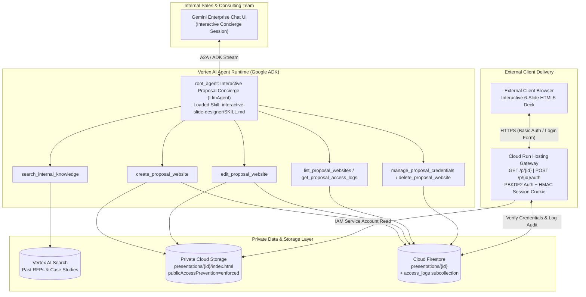

# Gemini Enterprise Proposal Site Publisher (`ge-proposal-site-publisher`)

[](LICENSE)
[](https://www.python.org/)
[](https://google.github.io/adk-docs/)

**English** | **[日本語 (Japanese)](#日本語ガイド-japanese)**

An end-to-end reference implementation and reusable Agent Skill suite for building an **Interactive Proposal Website Concierge Agent** on **Google Cloud (Gemini Enterprise + Vertex AI Agent Runtime + Cloud Run + Cloud Storage + Firestore)**.

Unlike static one-shot slide generators, `root_agent` operates as an **Interactive Proposal Concierge (`LlmAgent`)** that:
1. **Consults Conversationally First**: Greets users naturally (never generating slides prematurely on `"Hello"` or `"こんにちは"`), searches internal knowledge via Vertex AI Search (`search_internal_knowledge`), and collaborates on a 6-slide narrative outline.
2. **Generates Bespoke 6-Slide Interactive HTML5 Websites**: Loads the embedded **`interactive-slide-designer`** `SKILL.md` (`antigravity-preview-05-2026` / Vertex AI Gemini 2.5) to produce a self-contained, 16:9 responsive HTML5 presentation deck with 6 distinct layout archetypes (`hero-cover`, `bento-executive-summary`, `as-is-to-be-comparison`, `architecture-flow`, `roadmap-timeline`, `roi-and-next-steps`) and 5 executive color themes (`sky`, `emerald`, `violet`, `amber`, `rose`).
3. **Publishes Behind Zero-Trust Per-Client Authentication**: Uploads the HTML5 deck to a **private Cloud Storage bucket** (`publicAccessPrevention: enforced`), stores PBKDF2-HMAC-SHA256 (`120,000` iterations) credentials in **Firestore**, and serves external clients through a **Cloud Run Authentication & Audit Gateway**.
4. **Manages the Full Post-Publication Lifecycle in Chat**: Supports conversational slide editing (`edit_proposal_website`), portfolio listing (`list_proposal_websites`), client access log auditing (`get_proposal_access_logs`), password rotation & expiration extension (`manage_proposal_credentials`), and instant revocation (`delete_proposal_website`).

---

## Architecture



---

## Repository Structure

```text
ge-proposal-site-publisher/
├── skills/
│   ├── ge-proposal-site-publisher/        # Full-stack architecture, IAM & deployment skill
│   │   ├── SKILL.md
│   │   ├── references/architecture_and_iam.md
│   │   └── scripts/verify_sanitization.py
│   └── interactive-slide-designer/        # 6-slide HTML5 layout & design system skill
│       ├── SKILL.md
│       ├── references/design_patterns.md
│       └── scripts/validate_slide_deck.py
├── proposal_agent/                        # Google ADK Interactive Concierge Agent
│   ├── app/
│   │   ├── agent.py                       # root_agent (LlmAgent) + 7 lifecycle tools
│   │   ├── fast_api_app.py                # FastAPI entrypoint (ADK + A2A + Reasoning Engine)
│   │   ├── skills/interactive-slide-designer/
│   │   └── templates/deck_base.html.j2    # 6-layout HTML5 / Tailwind / SVG template
│   ├── Dockerfile
│   └── pyproject.toml
├── hosting_gateway/                       # Cloud Run Auth & Private GCS Streaming Proxy
│   ├── main.py                            # /health, /healthz, /p/{id}, /p/{id}/auth
│   ├── Dockerfile
│   ├── requirements.txt
│   └── firebase.json
├── infra/
│   ├── deploy.sh                          # One-command GCP provisioning & deployment
│   ├── cleanup.sh                         # Teardown helper
│   └── seed_datastore.py                  # Seeds synthetic RFP & case study documents
└── tests/
    ├── test_proposal_agent_and_gateway.py # Offline unit & security test suite (pytest)
    └── run_live_e2e_verification.py       # 6-step live cloud E2E verification script
```

---

## Quickstart (English)

### 1. Run Offline Unit & Security Tests

```bash
uv run --project proposal_agent pytest tests/test_proposal_agent_and_gateway.py -v
python3 skills/ge-proposal-site-publisher/scripts/verify_sanitization.py .
```

### 2. Deploy to Google Cloud

```bash
export PROJECT_ID="your-gcp-project-id"
export REGION="us-central1"
# Optional: Automatically register with an existing Gemini Enterprise App
# export GE_APP_ID="your-gemini-enterprise-app-id"

bash infra/deploy.sh
```

### 3. Run Live End-to-End Verification

```bash
export PROJECT_ID="your-gcp-project-id"
export HOSTING_BASE_URL="$(gcloud run services describe proposal-hosting-gateway --region=us-central1 --project=${PROJECT_ID} --format='value(status.url)')"

uv run --project proposal_agent python tests/run_live_e2e_verification.py
```

---

## 日本語ガイド (Japanese)

### 概要

本リポジトリは、**Gemini Enterprise** のチャット画面から対話形式でクライアント向け提案書を企画・壁打ちし、**6枚構成のインタラクティブHTML5プレゼンテーションWebサイト**を生成・限定公開・ライフサイクル管理するためのリファレンス実装および再利用可能なエージェントスキル（`SKILL.md`）一式です。

### 主な特徴

1. **対話型コンシェルジュ (`LlmAgent`) による段階的ヒアリング**:
   - 「こんにちは」などの挨拶に対して勝手にスライド生成を開始せず、まず実行可能な3つの機能を案内し、クライアント名・課題・希望テーマカラーをヒアリングします。
   - 過去のRFPや導入事例を `search_internal_knowledge` で検索し、6枚構成のアウトライン案を提示して合意形成してからWebサイトを発行します（即時生成を求められた場合はワンショット発行にも対応）。
2. **`interactive-slide-designer` スキルによる高品質6枚構成HTML5デッキ**:
   - 全6スライドがそれぞれ異なる専用レイアウト（`hero-cover` / `bento-executive-summary` / `as-is-to-be-comparison` / `architecture-flow` / `roadmap-timeline` / `roi-and-next-steps`）と5種類のカラーテーマ（`sky` / `emerald` / `violet` / `amber` / `rose`）を備え、キーボード（`←` / `→` / `F`）・スワイプ・印刷出力に対応します。
   - Claude Managed Agents API（`antigravity-preview-05-2026`）および Vertex AI Gemini 2.5 の両方に対応しています。
3. **非公開Cloud Storage + Cloud Run認証ゲートウェイによるセキュア限定公開**:
   - 生成されたHTMLはパブリックアクセスを完全遮断（`publicAccessPrevention: enforced`）した非公開GCSバケットに保存され、案件ごとに自動発行される閲覧ID・パスワード（PBKDF2-HMAC-SHA256 12万回ストレッチング）を知るクライアントのみがCloud Run経由で閲覧できます。
4. **発行後のフルライフサイクル管理（7つの専用ツール）**:
   - `search_internal_knowledge`: 社内ナレッジ・過去提案事例の検索
   - `create_proposal_website`: 6枚構成HTML5プレゼンサイトの新規生成・限定公開URL発行
   - `edit_proposal_website`: 発行済みサイトのタイトル・テーマカラー・スライド内容の対話修正と再デプロイ
   - `list_proposal_websites`: 発行済みプレゼンサイト一覧・ステータス確認
   - `get_proposal_access_logs`: クライアントのアクセス日時・認証方式・IP等の閲覧ログ監査
   - `manage_proposal_credentials`: パスワードのローテーション（再発行）および有効期限延長
   - `delete_proposal_website`: 公開停止（ステータスを `revoked` に変更し即座にHTTP 403遮断）およびGCSオブジェクト削除

### デプロイ手順

```bash
export PROJECT_ID="your-gcp-project-id"
export REGION="us-central1"
bash infra/deploy.sh
```

## License

Apache License 2.0. See [LICENSE](LICENSE) for details.
